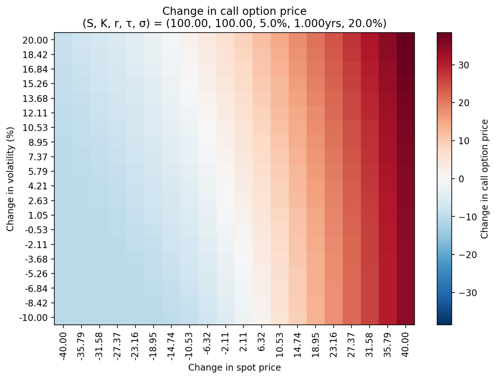

# Black-Scholes Option Pricer

An interactive dashboard for pricing European options with the Black-Scholes
model. Built with Streamlit. Prices calls and puts, shows the full Greek suite,
solves for implied volatility, and visualises how the option behaves as the
inputs move.



## Features

- Call and put prices, with a live put-call parity check as a sanity test
- The Greeks (Delta, Gamma, Vega, Theta, Rho), quoted in trader-friendly units
- Implied volatility solver (Newton-Raphson, using Vega as the derivative)
- Visualisations:
  - Heatmap of the change in call price across spot and volatility
  - Data table of the same grid
  - Payoff diagram (value at expiry vs value now)
  - Call and put price vs spot
  - Greeks vs spot

## Run locally

```bash
pip install -r requirements.txt
streamlit run dashboard.py
```

Then open the Local URL it prints (usually http://localhost:8501).

## Deploy (Streamlit Community Cloud, free)

1. Push this repo to GitHub (must include `dashboard.py`, `bs_funtions.py`, and `requirements.txt`).
2. Go to https://share.streamlit.io and sign in with GitHub.
3. Click **New app**, pick this repo, set the main file to `dashboard.py`, and deploy.
4. You get a public URL you can put in a CV or portfolio.

## Project structure

```
bs_funtions.py    # the maths: prices, Greeks, implied vol (no UI code)
dashboard.py      # the Streamlit interface and plots
requirements.txt  # dependencies
README.md
```

The maths is kept separate from the interface so it can be tested or reused
on its own.

## Model assumptions

Plain Black-Scholes: European exercise, no dividends, constant volatility and
interest rate, continuous trading.

## Possible extensions

- Continuous dividend yield `q`
- 3D price surface over spot x volatility
- American-style options (would need a different method, e.g. a binomial tree)
